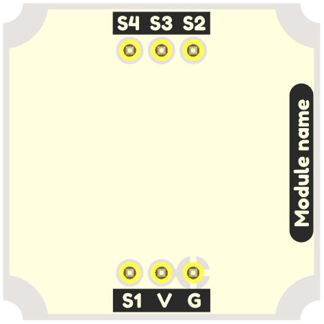
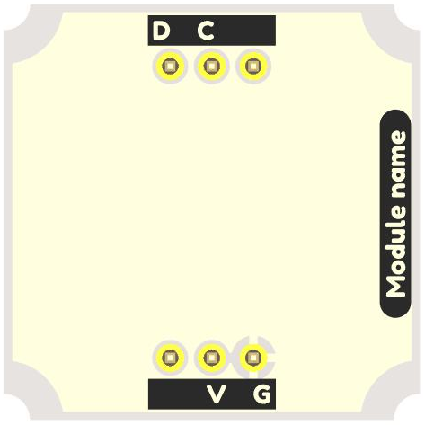
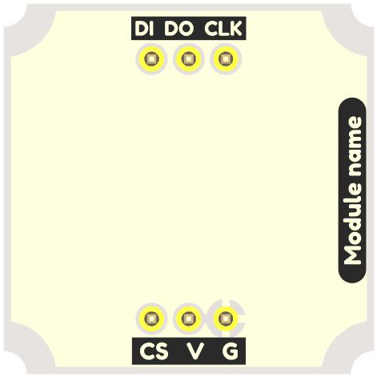
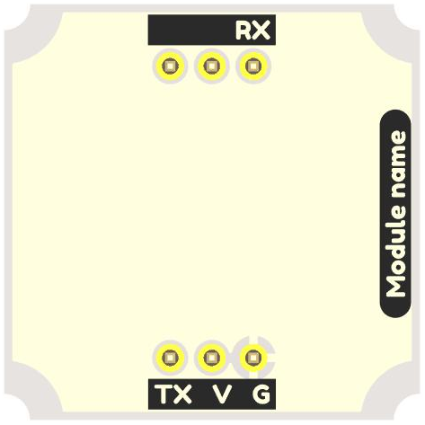
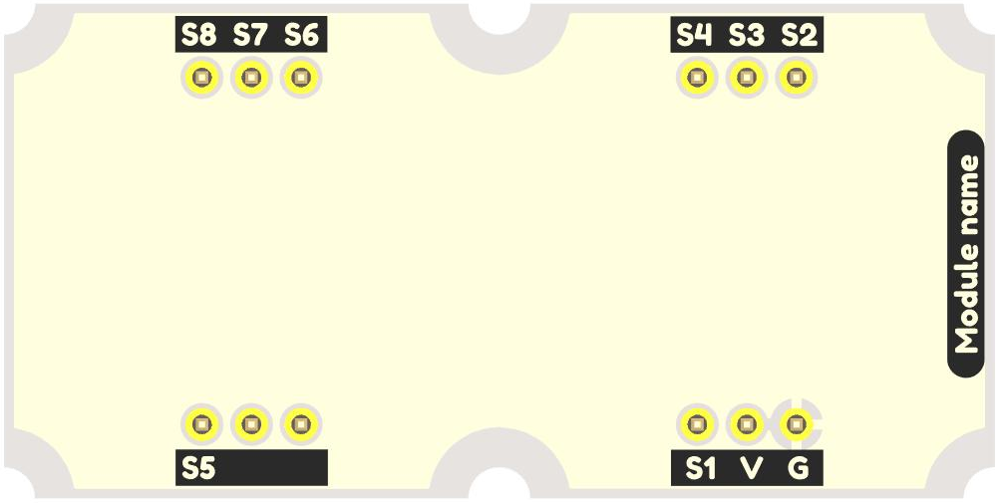
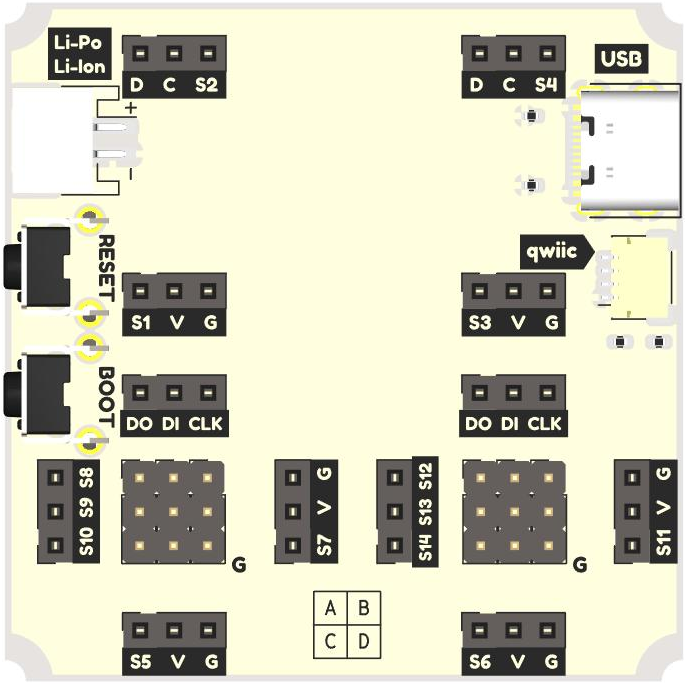

# Templates of Troyka modules and the Crabik Slot main board

This repository stores project templates for creating your own Troyka modules or base boards based on the Crabik Slot design. You can read more about Troyka modules on the [Amperka Wiki (ru)](http://wiki.amperka.ru/troyka-modules).

Schematics and board designs (KiCad projects), distributed as open hardware and available under [CERN-OHL-W v2](https://ohwr.org/cern_ohl_w_v2.pdf) license.

## [Troyka Base Module](https://github.com/CrabikBoards/troyka-and-slot-templates/tree/main/troyka-base-module)

## [Troyka I2C Module](https://github.com/CrabikBoards/troyka-and-slot-templates/tree/main/troyka-i2c-module)

## [Troyka SPI Module](https://github.com/CrabikBoards/troyka-and-slot-templates/tree/main/troyka-spi-module)

## [Troyka UART Module](https://github.com/CrabikBoards/troyka-and-slot-templates/tree/main/troyka-uart-module)

## [Troyka 2-unit Module](https://github.com/CrabikBoards/troyka-and-slot-templates/tree/main/troyka-2unit-module)

## [Crabik Slot Main board](https://github.com/CrabikBoards/troyka-and-slot-templates/tree/main/crabik-slot-template)

